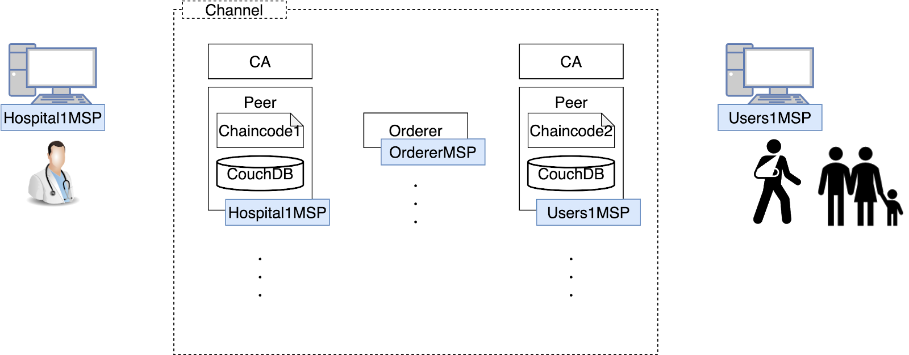
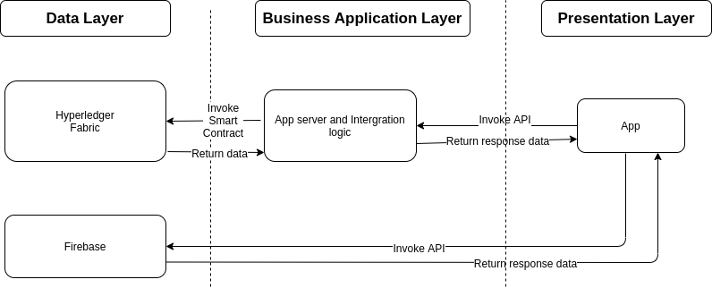

# Health Record (DAPP1 project in George Brown College)

A simple project simulates health record systems with transparent and security data using Hyperledger Fabric .

This project has 3 repositories:
* Front-end and document: https://github.com/leodinh/health-record .
* Back-end: https://github.com/leodinh/health-record-Back-End .
* Chaincode : https://github.com/leodinh/GBC_DAPP1_chaincode .

## Demo

Live Demo : https://leodinh.github.io/health-record/

## Introduction

A simple dapp aims to resolve the problem of patient consent to data sharing by using Hyperledger Fabric based on blockchain. It allows users to view their health records as well as other records which granted them a permission to access. Doctors can write or view their patients' records when they have a permission.

## Solution

Each patient has their own record which includes :

- Accesslist: people who can read the record and doctor can write on it.
- Allowedlist: list of patient id that can be accessed.
- Health records: history of medical records.
  Each doctor has their own patient list that they can access.
  
  _Health Record system_

## Architecture



_Diagram showing the architecture of Health Record App._

Three Layer:

- Presentation Layer: web application using Reactjs.
- Business Application Layer: server providing API using Nodejs and Expressjs.
- Database Layer: on-chain (Hyperledger Fabric) and off-chain (Firebase).

## Data Management

### On-chain data

| Variable Name | Type     | Key         | Value                                         | Notes              |
| ------------- | -------- | ----------- | --------------------------------------------- | ------------------ |
| patientRecord | `Object` | `patientID` | {`access_list`,`allowed_list`,`medical_info`} | record for patient |
| doctorRecord  | `Object` | `doctorID`  | {`allowed_list`}                              | record for doctor  |

- Details for the value of variable.
  | Name | Type | Details | Notes |
  |------|------|---------|--------------------------------------------------------------------|
  | access_list | `Array` | [{ `role`, `userID`},...] | list of ids can access record |
  | allowed_list | `Array` | [{`role`, `userID` },...] | list of ids that can be accessed |
  | medical_info | `Array` | [{`date`,`writer_id`,`information` },...] | list of health records |

### Off-chain data

- Email and password is used to authorize user. Firebase handle sign in and sign up.
- User information including full name and role is stored in Firebase.

## The Flow of Application

1. A patient sign in or sign up their own account,
2. In the first time, they are asked to choose role and write their name (a specific record is made in couchDB).
3. The patient allows a doctor to access his/her record.
4. Doctor selects a patient in his accessList and click button to query records of this patient.
5. After examination, the doctor writes a medical record into patient health record history.
6. Patients can get their medical records anytime.
7. If the patient sees another doctor, the patient adds the doctor into the permission list.
8. The patient can delete permission anytime.

## Front-End Build With

- Reactjs: App Framework.
- Redux: state management pattern + library for Reactjs application.
- Redux Saga: an redux middleware library.
- Firebase: data to store user information and authentication.

### Setup

```
npm install
or
yarn install
```

### Compiles and live-reloads for development

```
npm start
or
yarn start
```

## Team

- Nguyen Anh Tuan Dinh - 101201831
- Tomohiro Furuta - 101278396
- Lobsang Tenzin - 101247081
- Andres Ponton - 101216141
